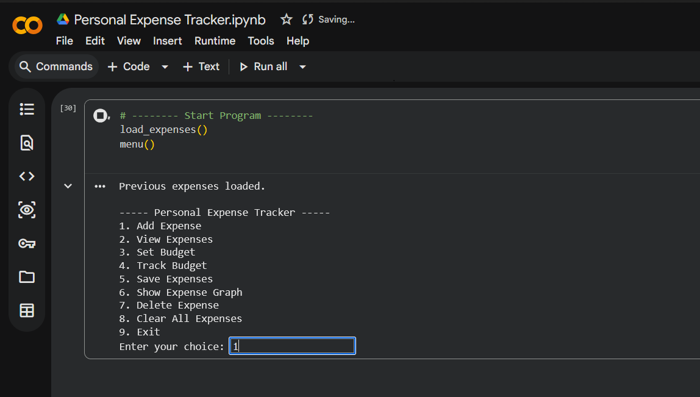
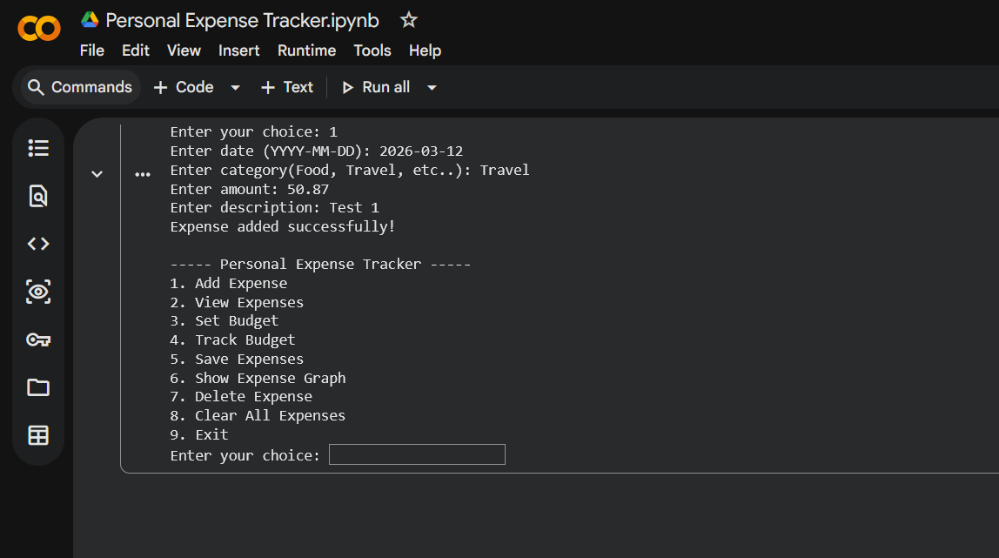
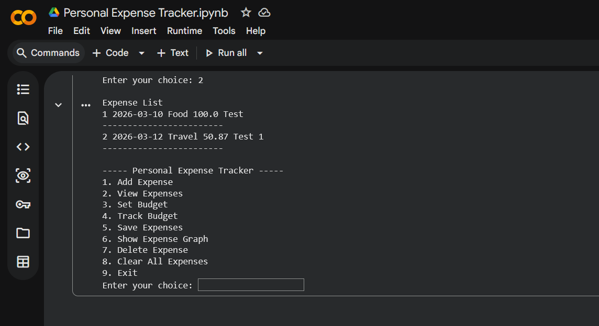
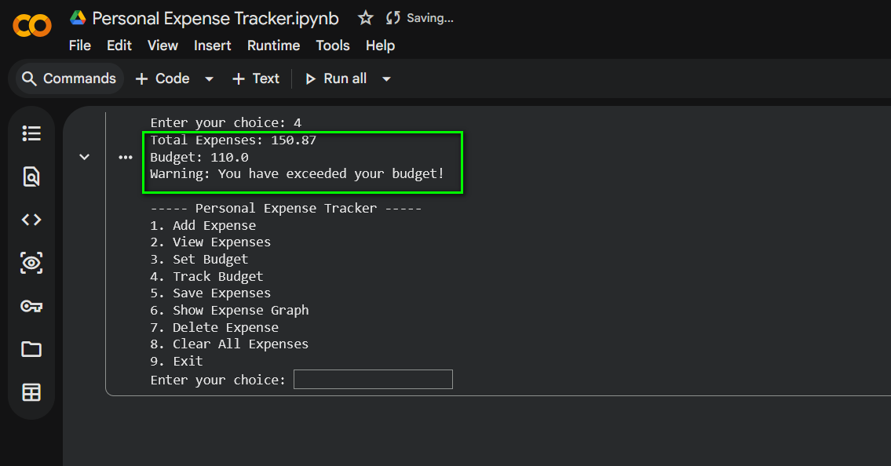

<h1 align="center">🤖 Personal Expense Tracker</h1>

## Overview

The **Personal Expense Tracker** is a Python-based application designed to help users record, manage, and analyze their daily expenses. The system allows users to add expenses, view records, track their monthly budget, and visualize spending patterns using graphs.

This project demonstrates how Python can be used to build a simple financial management tool for tracking personal expenses.

---

## Features

* Add new expenses with date, category, amount, and description
* View all recorded expenses
* Delete specific expenses
* Clear all expenses
* Set and track monthly budget
* Save expenses to a CSV file
* Load previous expenses automatically
* Visualize expenses using graphs

---

## Technologies Used

* **Python**
* **CSV (Comma Separated Values)**
* **Matplotlib**
* **Jupyter Notebook**

---

## Project Structure

```
SIMPLILEARN/
│
└── Expense Tracker/
    │
    ├── Personal Expense Tracker.ipynb
    ├── expenses.csv
    ├── README.md
    ├── writeup.md
    └── Screenshots/
```

---

## Installation

### 1 Clone the repository

```
git clone https://github.com/anisasunny/SIMPLILEARN.git
```

### 2 Navigate to the Expense Tracker folder

```
cd "Expense Tracker"
```

### 3 Install required library

```
pip install matplotlib
```

---

## Running the Project

Run the Python script or notebook.

### Using Python script

```
python expense_tracker.py
```

### Using Jupyter Notebook

Open:

```
Personal Expense Tracker.ipynb
```

Then run all cells.

---

## Menu Options

```
1. Add Expense
2. View Expenses
3. Set Budget
4. Track Budget
5. Save Expenses
6. Show Expense Graph
7. Delete Expense
8. Clear All Expenses
9. Exit
```

---

## Example Output

## 📸 Screenshots

| Dashboard | Add Expense |
|-----------|-------------|
|  |  |

| Expense List | Track Budget |
|--------------|---------|
|  |  |

## Advantages

* Simple and easy to use
* Helps users track daily spending
* Provides graphical insights into expenses
* Stores expense data for future use
* Lightweight command-line application

---

## Future Improvements

Possible enhancements include:

* Graphical User Interface (GUI)
* Web or mobile application
* Database integration
* Monthly financial reports
* Advanced analytics and predictions

---

## Author

**Anisa Sunny**
